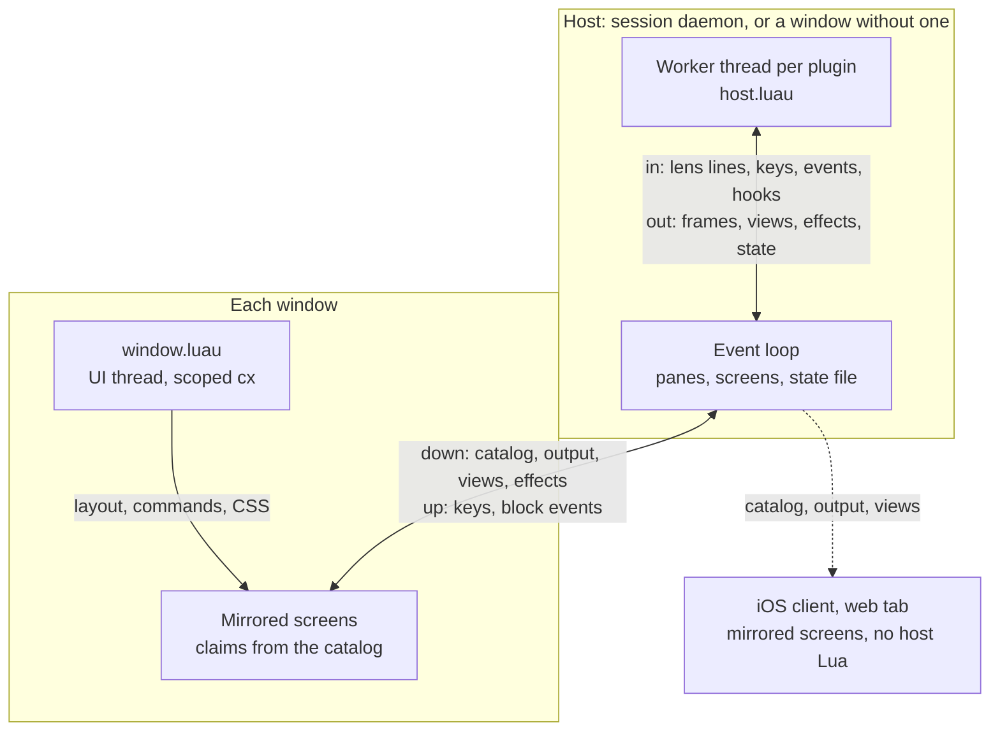

# Architecture

A plugin has up to two halves, each running its own Luau VM in a different
place. The host half runs where panes run and owns everything that has to
exist for every window at once; the window half runs inside each window and
changes how that window behaves. This page explains where each half runs, why
the boundary sits where it does, and how blocks, lenses and the plugin catalog
cross it.

## The two halves

| | Host half | Window half |
| --- | --- | --- |
| Entry | `host = "host.luau"` | `window = "window.luau"` |
| `tern.context` | `"host"` | `"window"` |
| Runs in | The session daemon, or a window that runs its panes without one | Every Tern window on the machine |
| Thread | One worker thread per plugin | The window's UI thread |
| VMs | One per plugin per host | One per plugin per window |
| Owns | Block types, command lenses, pane hooks, the `spawn` filter, `tern.pane` | Commands, key binds, overrides, routes, chrome formatters, `tern.css`, window events, `cx.layout` |
| Budget per call | 2 s | 4 ms for chrome formatters and `available`, 50 ms for everything else |

A manifest names at least one entry; a plugin with only one half is
common. Both halves of a plugin share its package directory and its data
directory, but not their Lua state: they run in different VMs, usually in
different processes, and talk to each other only through what Tern carries
between them (panes, blocks, effects, files).

## Why the split exists

Tern's panes, and the authoritative copy of each pane's screen, live in the
session daemon. Windows attach to the daemon and mirror the screens; when a
window quits, its panes keep running. Anything a plugin adds to a pane has to
live on that side too, or it would disappear with the window that added it
and never reach the other windows, the iOS client or the web tab. That is the
host half.

UI state is different: a window's tabs, focus, palette, keymap, chrome and
style sheets belong to that window and are mutated on its UI thread, one
event at a time. Code that changes them must run on that thread, inside the
window, with direct access to its state. That is the window half, and it
gets a `cx` for exactly that access.

The split follows from those two facts rather than from a choice of API:
host code never touches a window, and window code never owns a pane's
content.

## Where each half runs

| Situation | Host half | Window half |
| --- | --- | --- |
| Desktop window attached to the session daemon | In the daemon | In the window |
| Desktop window running its panes without a daemon | In the window's process, on worker threads | In the window |
| Remote host attached to your window | On the remote host, in its daemon, from its plugins folder | Yours applies to every pane in your windows, remote ones included |
| iOS client | Not run (host entries are skipped) | Run, interpreted |
| Web tab | Not run (no Lua) | Not run (no Lua) |

**Daemon.** The daemon loads its machine's plugins when it starts, before it
restores saved panes, so restored plugin blocks find their block types. Each
host half gets a worker thread; the daemon's event loop never runs Lua. It
hands workers lens lines, block input and pane events through channels and
applies what they send back (pane bytes, lens views, effects, saved state)
when they wake it. The loop waits on plugins in two places only: the `spawn`
filter (at most 50 ms per plugin, see
[Host Hooks and the Spawn Filter](../guides/hooks.md)) and loading or
reloading (each worker reports when its entry has run; a retiring worker gets
up to 3 s to let go of its blocks).

**A window without a daemon.** When a window runs its own panes, it starts
the same host runtime in its process from its first pane on, with the same
worker threads. Nothing changes for the plugin except that the "host" is
that window's process.

**Remote hosts.** A remote host's daemon loads the remote machine's plugins
from that machine's plugins folder, as the user the daemon runs as. Their
blocks and lenses appear in your window like any of that host's panes. Your
window half is local: it runs from your plugins folder and sees every pane
in your windows, local and remote. Install a host half on the machine whose
panes it should serve.

**iOS.** The iOS client runs window halves from its Files-app plugins folder
(see [Packages and Manifests](packages.md#directories)) in the interpreter,
and skips host entries. It shows blocks and lens views from the hosts it is
attached to.

**Web tab.** The web tab runs no Lua at all. It still receives the catalog
of its one host, the machine serving the page, so it opens the same lens
blocks and shows the same plugin blocks and views as any other replica,
styled by the plugins' manifest `styles` from that catalog. Only `tern.css`
sheets, which window halves add, are missing there.

See the [Support Matrix](support-matrix.md) for the full breakdown.

## Host workers

Each host half with a `host` entry gets one OS thread, named
`plugin <id>`, which owns that plugin's VM. Everything the plugin does on the
host runs there: block handlers, lens handlers, hooks, timers and process
callbacks. A plugin that loops until its 2 s budget trips stalls only its own
worker; other plugins and the daemon keep going.

Work queued by a handler through `cx` (a re-render, a save, an exit, a frame,
an effect, a pane write) is applied after the handler returns, never inside
it, so no handler runs inside another.

## Window VMs and `cx`

Window halves run on the UI thread of each window, one VM per plugin per
window. Every handler that can change the window receives a fresh `cx`
scoped to that call: `cx`, `cx.session` and `cx.layout` stop working when
the handler returns, and a stored `cx` raises when used later. Timers,
process and fetch callbacks receive their own fresh `cx`.

While a window handler runs, the window's plugins are taken out of the
window. A built-in reached from inside a handler (`cx:command("new_tab")`
from an override of `new_tab`, `cx:open` from a route) therefore runs Tern's
own behavior, not the plugins' again. See
[Commands, Keys, and Overrides](../guides/commands.md).

## Blocks: panes whose program is Lua

A plugin block is a daemon pane like a shell, except that its program is a
Lua table instead of a process. On start, the block opens a screen surface
with role `plugin.<plugin>.<block>` and speaks the Tern Surface Protocol the
same way a program would: every handler is followed by one frame of changes
to its view (and a title update when the title changed), written into the
pane's output. Because those bytes go through the pane like any program's:

- every window attached to the session mirrors the block, and so do iOS and
  the web tab;
- scripts read it, and the daemon's state file keeps it like any pane;
- after a daemon restart, the daemon starts the block again from the state
  its `save` returned last, on a blank screen.

Input travels the other way: keys and view events reach the block's worker
through the pane's link. See [Blocks](../guides/blocks.md).

## Lenses: declarative claims, views out of band

A command lens reads a shell command's output and shows a native view in its
place. Unlike a block, the pane's output belongs to the shell, and every
replica of the pane (the daemon's screen, each window's mirror, iOS, the web
tab) parses the same bytes and decides on its own, at the moment the command
starts, whether the output becomes a lens block. The replicas must all reach
the same decision, or their screens would disagree about which blocks exist.

Only the host runs Lua, so the decision cannot depend on Lua. Whether a
command gets a plugin lens is decided by the manifest's `match` globs alone,
which every replica has from the host's catalog. This is why a lens's `open`
handler cannot decline: by the time it runs on the host, every replica has
already opened the block. Narrow the globs instead.

The view cannot travel in the pane's output either: that stream is the
shell's, kept raw in the block and shared by every replica. So the host feeds
the captured lines to the plugin's worker, and sends the views it produces to
every replica as separate messages, at most once per 250 ms per block while
the command runs and once when it finishes. Replicas keep the block and show
the raw output until a view arrives; a `nil` view leaves the raw output
showing. See [Command Lenses](../guides/lenses.md).

## The catalog

Every host builds a catalog of its plugins and sends it to every window that
attaches (and again after each reload). It is the one piece of plugin state
every replica shares:

| Field | Used for |
| --- | --- |
| Plugins, each with id, name, version, description, icon and status | Preferences › Plugins, `tern plugin list`, problem toasts |
| Block types (id, title, icon, `files`, `palette`) | "New *title* block" palette rows, "Open with *title*" in file menus, pane titles and icons |
| Lens rules (id, `match` globs) | Lens claims on every replica |
| Manifest `styles`, concatenated | Remote hosts' plugin styles in your window; the serving host's in the web tab |
| Problems | Folders that are not usable plugins, and why |
| `jit` | Whether the host runs Luau with native code generation |

Only Ready plugins claim commands, offer block types or contribute styles.
See [Lifecycle and Reload](lifecycle.md) for statuses and how a new catalog
reaches windows.

## Data flow

## Ownership

| Thing | Owner | Lives in | Survives |
| --- | --- | --- | --- |
| Block type definition | Host half | Worker VM | Until reload |
| Running block and its Lua state | Host half | Daemon pane + worker VM | Reloads and daemon restarts, via `save` |
| Lens claim | Manifest | Catalog, on every replica | Until the manifest changes |
| Lens capture state | Host half | Worker VM, last 256 captures per plugin | Rebuilt from the block's raw output on demand |
| Lens view | Host half | Every replica's lens block | Sent by the host |
| Pane hooks and the `spawn` filter | Host half | Worker VM | Until reload |
| Commands, binds, overrides, routes, formatters | Window half | Window VM | Until reload |
| Plugin style sheets | Window runtime (local), window (remote hosts') | The window's style cascade | Re-added on reload |
| `tern.kv` data | Each VM | `<state>/plugin-data/<id>/kv.json` | Everything |

## Related pages

- [Packages and Manifests](packages.md): the package layout and naming.
- [Lifecycle and Reload](lifecycle.md): loading, reloading and restarts.
- [Runtime, Budgets, and JIT](runtime.md): the VM each half runs in.
- [Trust and Security](security.md): what each half can reach.
